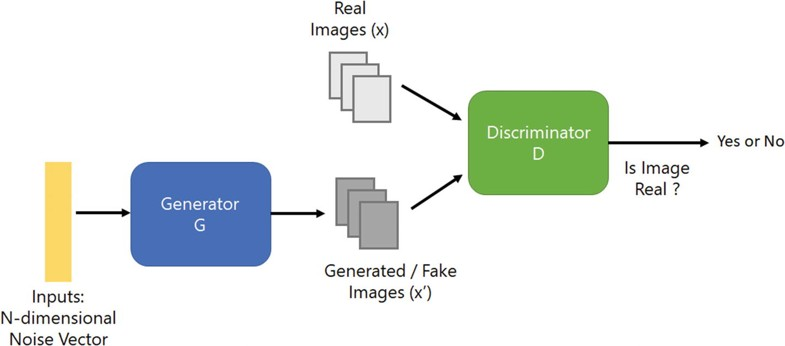
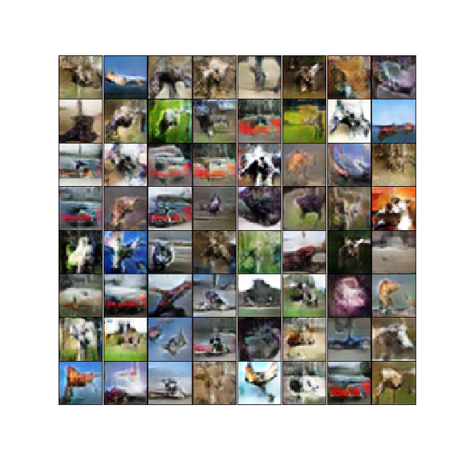
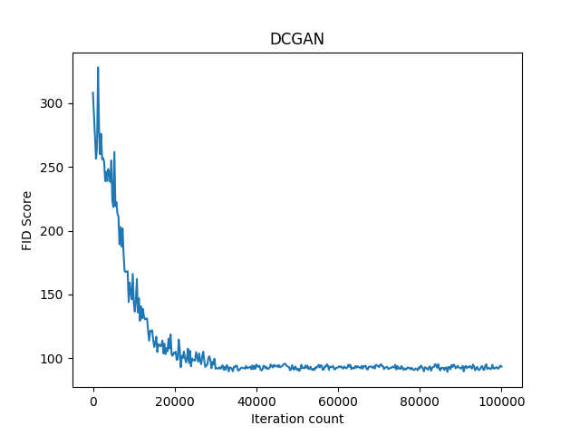
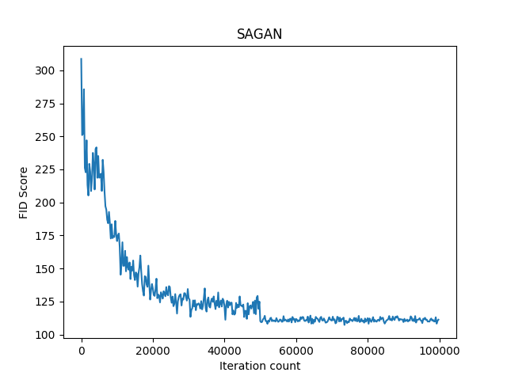
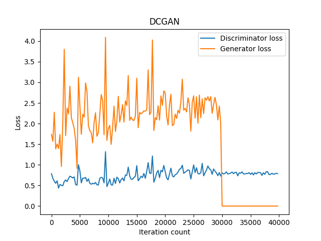
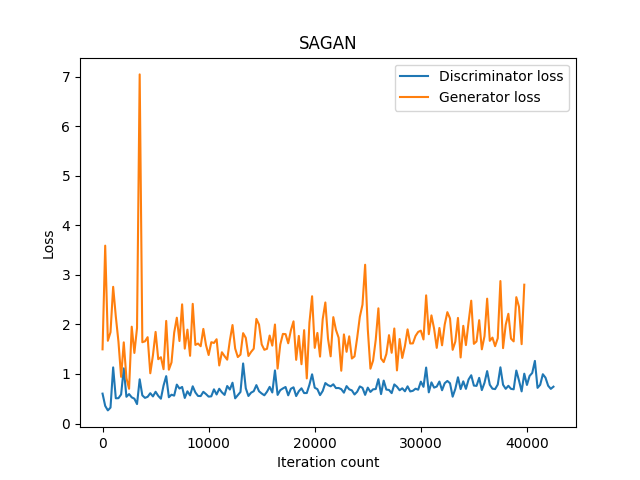

  [![Contributors][contributors-shield]][contributors-url] [![Forks][forks-shield]][forks-url] [![Stargazers][stars-shield]][stars-url] [![Issues][issues-shield]][issues-url] [![MIT License][license-shield]][license-url] [![LinkedIn][linkedin-shield]][linkedin-url]

<!-- PROJECT LOGO -->
<br />

<p align="center">
  <a href="https://github.com/vineeths96/Generative-Adversarial-Networks-GANs">
    
  </a>
  <h3 align="center">Generative Adversarial Networks (GAN)</h3>
  <p align="center">
    Deep convolutional GAN and Self attention GAN using CIFAR-10 dataset
    <br />
    <a href=https://github.com/vineeths96/Generative-Adversarial-Networks-GANs><strong>Explore the repository»</strong></a>
    <br />
    <br />
    <a href=https://github.com/vineeths96/Generative-Adversarial-Networks-GANs/blob/master/results/Project4.pdf>View Problem Statement</a>
    <a href=https://github.com/vineeths96/Generative-Adversarial-Networks-GANs/blob/master/results/Deep_Learning_Report_4.pdf>View Report</a>
  </p>


</p>

> tags : generative Adversarial Networks, gan,  dcgan, sagan, cifar-10, deep learning, tensorflow

<!-- TABLE OF CONTENTS -->
## Table of Contents

* [About the Project](#about-the-project)
  * [Built With](#built-with)
* [Getting Started](#getting-started)
  * [Prerequisites](#prerequisites)
  * [Instructions to run](#instructions-to-run)
* [Models overview](#models-overview)
  * [Deep Convolutional GAN](#deep-convolutional-gan)
  * [Self Attention GAN](#self-attention-gan)
* [Results](#results)
* [License](#license)
* [Contact](#contact)
* [Acknowledgements](#acknowledgements)


<!-- ABOUT THE PROJECT -->
## About The Project

This project is about learning a generative model from which new samples can be generated. The dataset used for this project is CIFAR-10. The CIFAR-10 dataset consists of 60000 32x32 colour images in 10 classes, with 6000 images per class. There are 50000 training images and 10000 test images.  In this project, two types of Generative Adversarial Networks (GANs) are implemented. 

* Deep Convolution GAN (DCGAN) 
* Self-Attention GAN (SA-GAN) 

Typically, in a simple neural network, we never focus on the weak points of the network. But if we can focus this weak point and train specifically for those weak points, we can train a better network. This strategy is employed in GANs through an adversary network which is known as Discriminator. This network keeps hammering on these weak points and forces the other neural network to train on these points. This scenario can be thought of as a two player game where, every time, one player finds a strategy that is extremely good against the opponent player, then the opponent player also learns a way to deal with that new strategy. Both players are continuously learning and competing with each other making each other stronger at the same time.

In GANs we typically have two networks – a generator (G) and a discriminator (D). D and G compete with each other making each other stronger at the same time. The GAN model is obtained by concatenating the G and D. A random noise vector of latent dimension from a Gaussian distribution (latent space) is provided as an input to G. The G produces an output image which is passed on as input to the D, which does a binary classification whether the input image is real or not. The G trains on the data and learns to produce a sample from the original data distribution (here, CIFAR-10). The D trains on data and learns to classify real image and fake image from the original data distribution.

G and D are working against each other like an adversarial zero-sum game. G is constantly trying to fool the D into believing that, the image generated by G is from the real data distribution while D is constantly learns to improve its efficiency in detecting fake images. In this process, G learns a transformation which enables one to convert the random noise input vector into a sample from the data distribution.

### Built With
This project was built with 

* python v3.7
* tensorflow v2.2
* jupyter notebooks
* The list of libraries used for developing this project is available at [requirements.txt](requirements.txt).


<!-- GETTING STARTED -->

## Getting Started

Clone the repository into a local machine using

```shell
git clone https://github.com/vineeths96/Generative-Adversarial-Networks-GANs
```

### Prerequisites

Please install required libraries by running the following command (preferably within a virtual environment).

```shell
pip install -r requirements.txt
```

The CIFAR-10 dataset is loaded using Tensorflow dataset API and hence manual downloading and setup is not necessary.

### Instructions to run

Two models - DCGAN and SAGAN - are implemented in this project. They are available in Jupyter notebooks [DCGAN](DCGAN.ipynb) and [SAGAN](SAGAN.ipynb). These notebooks were developed on Google Colab as they provide sufficient GPU resources to develop these models. To open these notebooks locally, run

```shell
jupyter-notebook <model_name>.ipynb
```


## Models overview

#### Deep Convolutional GAN

In DCGAN, I have used two convolutional neural networks (CNN) where one serves as a ‘Discriminator’ (D) and other serves as a ‘Generator’ (G). DCGANs exhibit limitations while modeling long term dependencies for image generation tasks. The problem with DCGANs exists because model relies heavily on convolution to model the dependencies across different image regions. Since convolution operator has a local receptive field, long ranged dependencies can only be processed after passing through several convolutional layers. 

View a detailed discussion on this in the [report](Deep_Learning_Report_4.pdf)

Grid of generated images from trained DCGAN is shown below. An animated GIF with grid images during training iterations is also provided. I have put ten DC-GAN generated images [here](./DCGAN/final_images/). The model attains a minimum FID score of 89.68. 

|  Final generator image grid   | Training generator image grid |
| :---------------------------: | :---------------------------: |
|  |  |


 #### Self Attention GAN

To mitigate the problems with DCGAN, self-attention was introduced in the GAN model which is called as self-attention GAN (SA-GAN). Self-Attention can model long-term dependencies while maintaining the computational efficiency. A general architecture for SA-GAN is shown in the image below. In every convolutional layer, I have used batch normalization to avoid the imbalance (vanishing/exploding) of the gradients and spectral normalization to constrains the Lipschitz constant of the convolutional filters. Spectral normalization is used as a way to stabilize the training of the discriminator network. 


View a detailed discussion on this in the [report](Deep_Learning_Report_4.pdf)

Grid of generated images from trained SAGAN is shown below. An animated GIF with grid images during training iterations is also provided. I have put ten SA-GAN generated images [here](./SAGAN/final_images/). The model attains a minimum FID score of 107.25.

|  Final generator image grid   | Training generator image grid |
| :---------------------------: | :---------------------------: |
|  |  |


<!-- RESULTS -->

## Results

|           **Model**            | **FID Score** |
| :----------------------------: | :-----------: |
| Deep Convolutional GAN (DCGAN) |     89.68     |
|   Self-Attention GAN (SAGAN)   |    107.25     |

The FID score and model losses during progression of training is shown in the plots below.

|                     DCGAN                     |                     SAGAN                     |
| :-------------------------------------------: | :-------------------------------------------: |
|   |   |
|  |  |


<!-- LICENSE -->

## License

Distributed under the MIT License. See `LICENSE` for more information.


<!-- CONTACT -->
## Contact

Vineeth S - vs96codes@gmail.com

Project Link: [https://github.com/vineeths96/Generative-Adversarial-Networks-GANs](https://github.com/vineeths96/Generative-Adversarial-Networks-GANs)


<!-- ACKNOWLEDGEMENTS -->
## Acknowledgements

* CIFAR-10 Dataset

  > [Learning Multiple Layers of Features from Tiny Images](https://www.cs.toronto.edu/~kriz/learning-features-2009-TR.pdf), Alex Krizhevsky, 2009.


<!-- MARKDOWN LINKS & IMAGES -->
<!-- https://www.markdownguide.org/basic-syntax/#reference-style-links -->

[contributors-shield]: https://img.shields.io/github/contributors/vineeths96/Generative-Adversarial-Networks-GANs.svg?style=flat-square
[contributors-url]: https://github.com/vineeths96/Generative-Adversarial-Networks-GANs/graphs/contributors
[forks-shield]: https://img.shields.io/github/forks/vineeths96/Generative-Adversarial-Networks-GANs.svg?style=flat-square
[forks-url]: https://github.com/vineeths96/Generative-Adversarial-Networks-GANs/network/members
[stars-shield]: https://img.shields.io/github/stars/vineeths96/Generative-Adversarial-Networks-GANs.svg?style=flat-square
[stars-url]: https://github.com/vineeths96/Generative-Adversarial-Networks-GANs/stargazers
[issues-shield]: https://img.shields.io/github/issues/vineeths96/Generative-Adversarial-Networks-GANs.svg?style=flat-square
[issues-url]: https://github.com/vineeths96/Generative-Adversarial-Networks-GANs/issues
[license-shield]: https://img.shields.io/badge/License-MIT-yellow.svg
[license-url]: https://github.com/vineeths96/Generative-Adversarial-Networks-GANs/blob/master/LICENSE
[linkedin-shield]: https://img.shields.io/badge/-LinkedIn-black.svg?style=flat-square&logo=linkedin&colorB=555
[linkedin-url]: https://linkedin.com/in/vineeths

